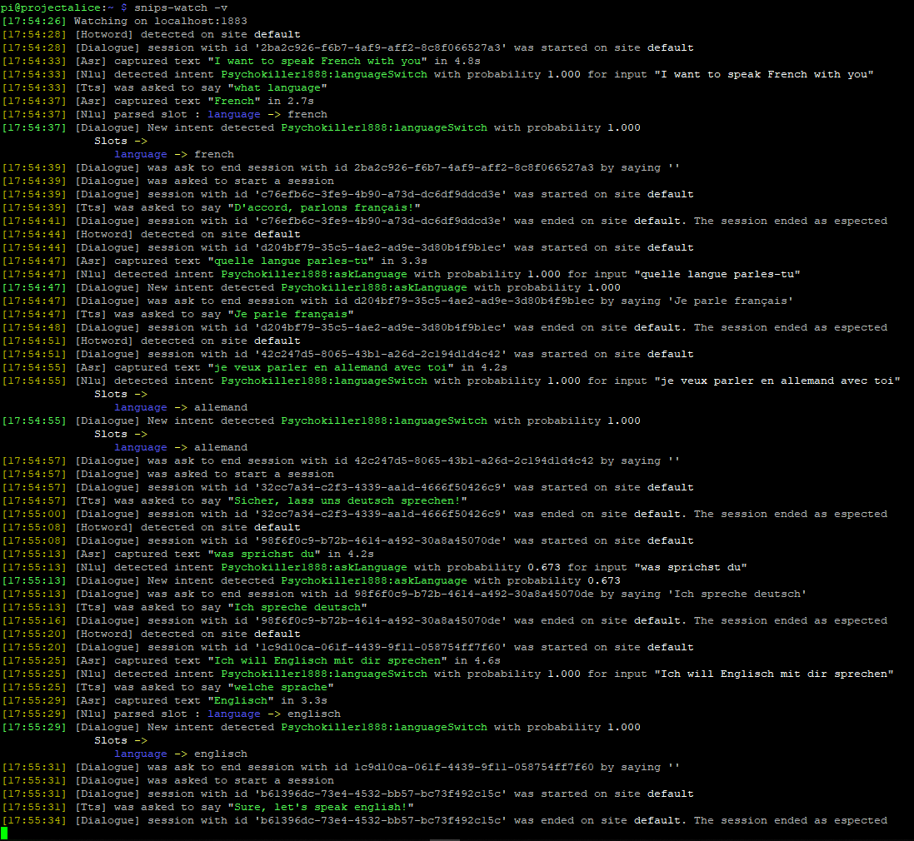

# snipslanghotswap
Change your assistant language by asking it!

Clone this repository on your raspberry:
> git clone https://github.com/Psychokiller1888/snipslanghotswap.git

Cd to the directory
> cd snipslanghotswap

Make langSwitch.sh executable:
> sudo chmod +x langSwitch.sh

If you are already running snips, delete the old assistant:
> sudo rm -r /usr/share/snips/assistant

Copy the english assistant
> sudo cp -r assistants/assistant_en /usr/share/snips/assistant

Restart snips:
> sudo systemctl restart "snips*"

Start the script:
> python main.py

In another Kitty/Putty instance, or another terminal, start snips-watch
> snips-watch -v

# How it's made and how can I repro this

They key behind that is to have different assistants, in their own directories, with the same bundles and most importantly, the same intents, but trained in their own language! You can easily extend this by adding other language assistants and declare their shortcode in main.py line **17**, add a confirmation message on line **30** and add an answer on line **36**

This demo has one bundle with two intents:
- languageSwitch: Does actually switch the language
- askLanguage: Snipe answers you the language currently in use

This demo support english, french and german.

Then, a simple call to **langSwitch.sh** with the language shortcode is enough to switch. The very small bash script will remove the old assistant, copy the new one in place, restart snips wiat a short while as it's needed. Then the script wil lcontinue and confirm the switch in the new language.

The current language is kept in a sqlite3 database, in a table called "config" that can be extended to your own needs. The table has two columns "_configName_" and "_configValue_", TEXT as NOT NULL. Be aware that the table doesn't have any unique identifier if you intend to use it

# Demo
https://www.youtube.com/watch?v=RE6SePehWCk

__To switch language you have (replace language by either english, french or german):__

- i want to speak french with you
- can we speak french together
- please switch to french
- let's speak french

- change ta langue en anglais
- peut-on parler en anglais s'il te plait
- parlons en anglais s'il te plait
- je veux parler en anglais avec toi

- ich will englisch mit dir sprechen
- sprechen wir englisch
- bitte, rede englisch
- stell auf englisch um

__To ask the language (replace language by either english, french or german):__

- what language do you speak
- what do you speak
- do you speak english
- what is your language

- quelle langue parles tu
- quelle est ta langue actuelle
- parles-tu français

- sprichst du deutsch
- was für eine Sprache sprichst du
- was sprichst du

